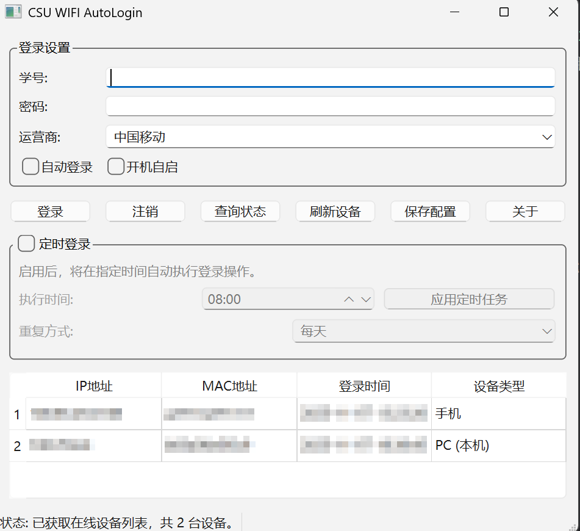

# 中南校园网助手（CSU-WIFI-AutoLogin）

在 Windows 上一键登录 CSU-Student，提供自动登录、定时登录、开机自启与设备状态查看。

---

## 下载

1. 打开项目仓库的 [Releases](https://github.com/Temparo/CSU-WIFI-AutoLogin/releases/latest)页面。
2. 下载后缀为.exe的文件
3. 直接双击运行 `CSU-WIFI-AutoLogin.exe`

---

## 反馈

如遇问题，请创建 Issue，并附：

- 复现步骤
- 相关截图

---

## 致谢与声明

- 接口参考：CSU-Net-Portal（https://github.com/barkure/CSU-Net-Portal）
- 本工具仅用于简化合法校园网登录流程，请遵守学校网络使用规范。接口或策略变动可能导致功能失效。
